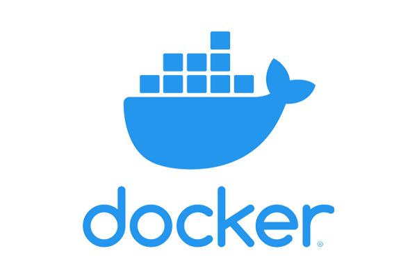

<!-- WIP -->

<h1 align="center">Projeto MySQL - All For One</h1>

 
  

<!-- TABLE OF CONTENTS -->
<h2 id="table-of-contents"> :book: Tabela de Conteúdos</h2>

  
Tabela de conteúdos

  <ol>
    <li><a href="#sobre"> ➤ Sobre o projeto</a></li>
    <li><a href="#tecnologias"> ➤ Tecnologias utilizadas</a></li>
    <li><a href="#descrição-do-projeto"> ➤ Descrição do projeto</a></li>
    <li><a href="#instruções"> ➤ Instruções</a></li>
    <li><a href="#requisitos"> ➤ Requisitos realizados </a></li>
    <li><a href="#requisito1"> ➤ Requisito 1: Buscando dados específicos em uma tabela </a></li>
    <li><a href="#requisito2"> ➤ Requisito 2: Buscando todos os dados contidos em uma tabela </a></li>
    <li><a href="#requisito3"> ➤ Requisito 3: Buscando primary keys em uma tabela </a></li>
    <li><a href="#requisito4"> ➤ Requisito 4: Contando elementos de uma busca </a></li>
    <li><a href="#requisito5"> ➤ Requisito 5: Buscando uma quantia de dados específica </a></li>
    <li><a href="#requisito6"> ➤ Requisito 6: Buscando dados e ordenando </a></li>
    <li><a href="#requisito7"> ➤ Requisito 7: Buscando dados, ordenando e limitando a quantia </a></li>
    <li><a href="#requisito8"> ➤ Requisito 8: Buscando dados, utilizando Alias e exibindo operações aritméticas </a></li>
    <li><a href="#requisito9"> ➤ Requisito 9: Filtrando por valores não nulos </a></li>
    <li><a href="#requisito10"> ➤ Requisito 10: Filtrando por condicional "OR" e ordenando os dados </a></li>
    <li><a href="#requisito11"> ➤ Requisito 11: Filtrando por string </a></li>
    <li><a href="#requisito12"> ➤ Requisito 12: Filtrando por data </a></li>
    <li><a href="#requisito13"> ➤ Requisito 13: Filtrando por condicional "OR" </a></li>
    <li><a href="#requisito14"> ➤ Requisito 14: Filtrando por condicional "AND" </a></li>
    <li><a href="#requisito15"> ➤ Requisito 15: Filtrando por hora, usando Alias </a></li>
    <li><a href="#requisito16"> ➤ Requisito 16: Filtrando datetime por condicionais </a></li>
    <li><a href="#requisito17"> ➤ Requisito 17: Filtrando por uma lista de possibilidades </a></li>
    <li><a href="#requisito18"> ➤ Requisito 18: Filtrando por condicional "AND" </a></li>
    <li><a href="#requisito19"> ➤ Requisito 19: Filtrando por condicionais, contando elementos e usando Alias </a></li>
    <li><a href="#requisito20"> ➤ Requisito 20: Inserindo 1 linha de dados em uma tabela </a></li>
    <li><a href="#requisito21"> ➤ Requisito 21: Inserindo várias linhas de dados em uma tabela </a></li>
    <li><a href="#requisito22"> ➤ Requisito 22: Atualizando dados em uma tabela </a></li>
    <li><a href="#requisito23"> ➤ Requisito 23: Atualizando dados por uma condicional </a></li>
    <li><a href="#requisito24"> ➤ Requisito 24: Atualizando dados por combinação de condicionais </a></li>
    <li><a href="#requisito25"> ➤ Requisito 25: Deletando dados por condicional </a></li>
    <li><a href="#requisito26"> ➤ Requisito 26: Deletando dados por condicional </a></li>
    <li><a href="#requisito27"> ➤ Requisito 27: Deletando todos os dados de uma tabela </a></li>
    <li><a href="#créditos"> ➤ Créditos </a></li>
  </ol>

<h2 id="sobre"> :pencil: Sobre o projeto </h2>

  
Projeto desenvolvido durante a formação de BackEnd na Trybe com o intuito de consolidar o aprendizado de SQL e MySQL Workbench.

<h2 id="tecnologias"> :computer: Tecnologias utilizadas</h2>

  
  
  
  

<h2 id="descrição-do-projeto"> :page_facing_up: Descrição</h2>

  
Descrição
 
  
  Neste projeto eu realizei:
  
  <ol>
    <li>Consolidação de conceitos e comandos de SQL;</li>
  </ol> 

  Tem-se um banco de dados (`Northwind`) e uma série de requisitos com diferentes níveis de complexidade neste repositório. 
  Durante o desenvolvimento foi utilizado Docker para evitar a restauração manual do banco de dados no MySQL Workbench. 
  Foram desenvolvidos os arquivos contendo apenas o comando necessário para resolver o requisito pedido. 

<h2 id="instruções"> :scroll: Instruções</h2>

1. Clone o repositório
  * `git clone git@github.com:Gabrielle-Murat/MySQL-AllForOne.git`
  * Entre na pasta do repositório que você acabou de clonar;
 

2. Instale as dependências:
  * `npm install`
 

3. Como restaurar o banco de dados, se necessário:
  * Abra o MySQL Workbench,
  * Abra uma nova aba de query e cole dentro dela todo o conteúdo do arquivo `northwind.sql`,
  * Execute a query e aguarde alguns segundos,
  * Atualize a lista de dbs;

<h2 id="requisitos"> :woman_technologist: Requisitos Realizados:</h2>

  
Queries iniciais:

  <h4 id="requisito1">Requisito 1: Buscando dados específicos em uma tabela</h4>
  
    1. Exibir apenas os nomes dos produtos na tabela `products`

  <h4 id="requisito2">Requisito 2: Buscando todos os dados contidos em uma tabela</h4>
  
    2. Exibir os dados de todas as colunas da tabela `products`

  <h4 id="requisito3">Requisito 3: Buscando primary keys em uma tabela</h4>
  
    3. Escrever uma query que exiba os valores da coluna que representa a primary key da tabela `products`

  <h4 id="requisito4">Requisito 4: Contando elementos de uma busca</h4>
  
    4. Contar quantos registros existem na coluna `product_name` da tabela `products`

  <h4 id="requisito5">Requisito 5: Buscando uma quantia de dados específica</h4>
  
    5. Montar uma query que exiba os dados da tabela `products` a partir do quarto registro até o décimo terceiro

  <h4 id="requisito6">Requisito 6: Buscando dados e ordenando</h4>
  
    6. Exibir os dados das colunas `product_name` e `id` da tabela `products` de maneira que os resultados estejam em ordem alfabética dos nomes

  <h4 id="requisito7">Requisito 7: Buscando dados, ordenando e limitando a quantia</h4>
  
    7. Mostrar apenas os `id`s dos 5 últimos registros da tabela `products` (a ordernação deve ser baseada na coluna `id`)

  <h4 id="requisito8">Requisito 8: Buscando dados, utilizando Alias e exibindo operações aritméticas</h4>
  
    8. Fazer uma consulta que retorne três colunas, respectivamente, com os nomes `A`, `Trybe` e `eh`, e com valores referentes a soma de `5 + 6`, a string `de`, a soma de `2 + 8`

 

  
Filtragem de dados:

  <h4 id="requisito9">Requisito 9: Filtrando por valores não nulos</h4>
  
    9. Mostrar todos os valores de `notes` da tabela `purchase_orders` que não são nulos

  <h4 id="requisito10">Requisito 10: Filtrando por condicional "OR" e ordenando os dados</h4>
  
    10. Mostrar todos os dados da tabela `purchase_orders` em ordem decrescente, ordenados por `created_by` em que o `created_by` é maior ou igual a 3

  <h4 id="requisito11">Requisito 11: Filtrando por string</h4>
  
    11. Exibir os dados da coluna notes da tabela `purchase_orders` em que seu valor de `Purchase generated based on Order` é maior ou igual a 30 e menor ou igual a 39
  
  <h4 id="requisito12">Requisito 12: Filtrando por data</h4>
  
    12. Mostrar as `submitted_date` de `purchase_orders` em que a `submitted_date` é do dia 26 de abril de 2006
  
  <h4 id="requisito13">Requisito 13: Filtrando por condicional "OR"</h4>
  
    13. Mostrar o `supplier_id` das `purchase_orders` em que o `supplier_id` seja 1 ou 3
  
  <h4 id="requisito14">Requisito 14: Filtrando por condicional "AND"</h4>
  
    14. Mostrar os resultados da coluna `supplier_id` da tabela `purchase_orders` em que o `supplier_id` seja maior ou igual a 1 e menor ou igual 3
  
  <h4 id="requisito15">Requisito 15: Filtrando por hora, usando Alias</h4>
  
    15. Mostrar somente as horas (sem os minutos e os segundos) da coluna `submitted_date` de todos registros da tabela `purchase_orders`

  <h4 id="requisito16">Requisito 16: Filtrando datetime por condicionais</h4>
  
    16. Exibir a `submitted_date` das `purchase_orders` que estão entre `2006-01-26 00:00:00` e `2006-03-31 23:59:59`r

  <h4 id="requisito17">Requisito 17: Filtrando por uma lista de possibilidades</h4>
  
    17. Mostrar os registros das colunas `id` e `supplier_id` das `purchase_orders` em que os `supplier_id` sejam tanto 1, ou 3, ou 5, ou 7
  
  <h4 id="requisito18">Requisito 18: Filtrando por condicional "AND"</h4>
  
    18. Mostrar todos os registros de `purchase_orders` que tem o `supplier_id` igual a 3 e `status_id` igual a 2
  
  <h4 id="requisito19">Requisito 19: Filtrando por condicionais, contando elementos e usando Alias</h4>
  
    19. Mostrar a quantidade de pedidos que foram feitos na tabela `orders` pelo `employee_id` igual a 5 ou 6, e que foram enviados através do método(coluna) `shipper_id` igual a 2

 

  
Manipulação de tabelas:

  <h4 id="requisito20">Requisito 20: Inserindo 1 linha de dados em uma tabela</h4>
  
    20. Adicionar à tabela `order_details` um registro com: `order_id`: 69, `product_id`: 80, `quantity`: 15.0000, `unit_price`: 15.0000, `discount`: 0, `status_id`: 2, `date_allocated`: NULL, `purchase_order_id`: NULL e `inventory_id`: 129
  
  <h4 id="requisito21">Requisito 21: Inserindo várias linhas de dados em uma tabela</h4>
  
    21. Adicionar com um único `INSERT`, duas linhas à tabela `order_details` com os mesmos dados do requisito 20
  
  <h4 id="requisito22">Requisito 22: Atualizando dados em uma tabela</h4>
  
    22. Atualizar os dados de `discount` do `order_details` para 15
  
  <h4 id="requisito23">Requisito 23: Atualizando dados por uma condicional</h4>
  
    23. Atualizar os dados da coluna `discount` da tabela `order_details` para 30, onde o valor na coluna `unit_price` seja menor que 10.0000
  
  <h4 id="requisito24">Requisito 24: Atualizando dados por combinação de condicionais</h4>
  
    24. Atualizar os dados da coluna `discount` da tabela `order_details` para 45, onde o valor na coluna `unit_price` seja maior que 10.0000 e o `id` seja um número entre 30 e 40
  
  <h4 id="requisito25">Requisito 25: Deletando dados por condicional</h4>
  
    25. Deletar todos os dados em que a `unit_price` da tabela `order_details` seja menor que 10.0000
  
  <h4 id="requisito26">Requisito 26: Deletando dados por condicional</h4>
  
    26. Deletar todos os dados em que a `unit_price` da tabela `order_details` seja maior que 10.0000
  
  <h4 id="requisito27">Requisito 27: Deletando todos os dados de uma tabela</h4>
  
    27. Deletar todos os dados da tabela `order_details`

 

<h2 id="créditos"> 💳 Créditos</h2>

Banco de dados (Northwind) e docker compose (docker-compose.yml) fornecidos pela Trybe.

